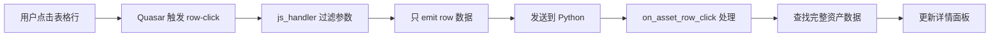

# NiceGUI 表格行点击事件解决方案

## 问题背景

在 BDC-AI 项目的 PC 端界面开发中，使用 NiceGUI 的 `ui.table` 组件实现资产列表展示。核心需求是：**点击表格中的任意一行，右侧详情面板实时更新显示该资产的详细信息**。

### 技术栈
- **NiceGUI**: 2.7.0 → 3.5.0 (升级)
- **后端**: FastAPI + SQLAlchemy
- **数据库**: PostgreSQL

---

## 问题描述

### 核心问题
NiceGUI 的 `ui.table` 组件无法在 Python 端正确监听表格行的点击事件，导致无法实现"点击表格行 → 更新详情面板"的联动功能。

### 表现现象
1. 表格选择功能正常：点击表格行会显示 "1 record selected"
2. 详情面板无法更新：无论点击哪一行，右侧详情始终显示固定的资产信息
3. 无错误提示：控制台没有任何错误或警告信息

---

## 解决方案探索过程

### 尝试方案 1：使用 `table.on("rowClick")` (失败)

**代码**:
```python
@asset_table.on("rowClick")
async def on_asset_row_click(e):
    row = e.args  # 期望获取行数据
    # ... 更新详情
```

**问题**:
- 事件从未被触发（无调试输出）
- `Table` 对象没有 `on()` 方法（旧版本 NiceGUI）

**错误信息**:
```
AttributeError: 'Table' object has no attribute 'on'
```

---

### 尝试方案 2：访问 `table.selection` 属性 (失败)

**代码**:
```python
selection = asset_table.selection
row = selection[0]
```

**问题**:
```
AttributeError: 'Table' object has no attribute 'selection'
```

NiceGUI 的 Table 对象不暴露 `selection` 属性。

---

### 尝试方案 3：使用定时器轮询 (失败)

**代码**:
```python
def check_table_selection():
    table_props = asset_table._props
    selection = table_props.get('selection', [])
    # 检查变化并更新

ui.timer(1.0, check_table_selection)
```

**问题**:
- `_props['selection']` 始终为空列表
- 无法获取用户的选择状态
- 轮询方式不优雅，性能差

---

### 尝试方案 4：使用 Quasar 原生事件 `@selection` (失败)

**代码**:
```python
asset_table.props('@selection=on_asset_select')
```

**问题**:
- 事件处理函数从未被触发
- Vue 事件无法正确桥接到 Python

---

### 尝试方案 5：分两步 - js_handler + 自定义事件 (失败)

**代码**:
```python
# 第一步：js_handler emit 到自定义事件
asset_table.on("rowClick", js_handler="(evt, row, index) => emit('assetSelected', row)")

# 第二步：监听自定义事件
asset_table.on("assetSelected", on_asset_selected)
```

**问题**:
```
ValueError: Either handler or js_handler can be specified, but not both
```

**NiceGUI 2.7.0 限制**: `element.on()` 方法不允许同时指定 `handler` 和 `js_handler`。

---

### 尝试方案 6：使用 `run_javascript` 直接操作 Vue 组件 (部分成功)

**代码**:
```python
# 注册 Python 处理函数
asset_table.on("tableRowClicked", handle_asset_row_click)

# 通过 JavaScript 添加 Vue 事件监听
ui.run_javascript(f'''
    setTimeout(() => {{
        const table = document.querySelector("#c-{asset_table.id} table");
        if (table && table.__vueParentComponent__) {{
            table.__vueParentComponent.$on("rowClick", (evt, row, index) => {{
                emit("tableRowClicked", row);
            }});
        }}
    }}, 500);
''')
```

**问题**:
- 依赖 Vue 2 的 `$on` API（已废弃）
- 实现复杂，维护困难
- 需要等待 DOM 渲染完成
- 不稳定，可能失效

---

## ✅ 最终解决方案：升级 NiceGUI 到 3.5.0

### 核心突破

**NiceGUI 3.5.0** 官方支持同时使用 `handler` 和 `js_handler`，完美解决此问题！

### 实现代码

```python
# 表格行点击：使用 NiceGUI 的通用事件接口 + js_handler 直接拿到 row
def on_asset_row_click(e: Any) -> None:
    nonlocal selected_asset

    row = e.args
    # 兼容 emit(row) 或 emit([row]) 两种情况
    if isinstance(row, list):
        if not row:
            return
        row = row[0]
    if not isinstance(row, dict):
        return

    asset_id = row.get("id")
    if not asset_id:
        return

    # 从 all_assets_for_device 中找到完整资产对象（包含 file_path 等字段）
    for asset in all_assets_for_device:
        if str(asset.get("id")) == str(asset_id):
            selected_asset = asset
            break
    else:
        # 兜底：直接用行数据
        selected_asset = row

    update_asset_detail()

# 关键：同时指定 handler 和 js_handler
asset_table.on(
    "rowClick",
    on_asset_row_click,
    js_handler="(evt, row, index) => emit(row)",
)
```

---

## 技术要点解析

### 1. Quasar QTable 的事件签名

```javascript
row-click(evt, row, index)
```

- **evt**: 浏览器 MouseEvent 对象
- **row**: 被点击的行数据（dict）
- **index**: 行索引

### 2. NiceGUI 的默认行为

**默认 js_handler**:
```javascript
(...args) => emit(...args)
```

这会将所有参数 emit 到 Python，但 Python 端只能接收到第一个参数（evt），导致拿不到 row 数据。

### 3. 自定义 js_handler 的作用

```javascript
(evt, row, index) => emit(row)
```

**作用**:
- 只 emit 第二个参数 `row`
- 过滤掉不需要的 MouseEvent 和 index
- Python 端直接接收到干净的行数据

### 4. NiceGUI 3.5.0 的改进

在 NiceGUI 3.5.0 中，`element.on()` 方法的签名支持：

```python
def on(
    self,
    type: str,
    handler: Optional[Callable[[ValueChangeEventArguments], Any]] = None,
    *,
    js_handler: Optional[str] = None,
) -> Element:
    ...
```

**关键**:
- `handler` 和 `js_handler` 可以同时指定
- `js_handler` 在前端执行，可以 emit 数据
- `handler` 在后端执行，接收 emit 的数据

---

## 完整工作流程



---

## 关键代码片段

### 表格创建

```python
asset_table = ui.table(
    columns=[
        {"name": "id", "label": "ID", "field": "id"},
        {"name": "title", "label": "标题", "field": "title"},
        {"name": "modality", "label": "类型", "field": "modality"},
        {"name": "content_role", "label": "角色", "field": "content_role"},
        {"name": "capture_time", "label": "采集时间", "field": "capture_time"},
    ],
    rows=[],
).classes("w-full")
```

### 事件绑定

```python
asset_table.on(
    "rowClick",
    on_asset_row_click,
    js_handler="(evt, row, index) => emit(row)",
)
```

### 数据处理

```python
def on_asset_row_click(e: Any) -> None:
    nonlocal selected_asset

    row = e.args  # 已经是干净的行数据

    # 类型兼容处理
    if isinstance(row, list):
        if not row:
            return
        row = row[0]
    if not isinstance(row, dict):
        return

    # 提取 ID
    asset_id = row.get("id")
    if not asset_id:
        return

    # 查找完整资产数据（包含 file_path 等额外字段）
    for asset in all_assets_for_device:
        if str(asset.get("id")) == str(asset_id):
            selected_asset = asset
            break
    else:
        selected_asset = row

    # 更新 UI
    update_asset_detail()
```

---

## 升级步骤

### 1. 升级 NiceGUI

```bash
pip install --upgrade nicegui
```

**版本要求**: >= 3.5.0

### 2. 验证版本

```python
import nicegui
print(nicegui.__version__)  # 应显示 3.5.0 或更高
```

### 3. 重启服务

```bash
# 停止旧服务
# 启动新服务
python -m desktop.nicegui_app.pc_app
```

---

## 最佳实践

### ✅ 推荐做法

1. **使用明确的 js_handler**
   ```python
   js_handler="(evt, row, index) => emit(row)"
   ```
   - 只传递需要的数据
   - 减少序列化开销
   - 避免传递大型 MouseEvent 对象

2. **类型兼容处理**
   ```python
   if isinstance(row, list):
       row = row[0]
   if not isinstance(row, dict):
       return
   ```
   - 兼容不同的 emit 格式
   - 防御性编程

3. **数据完整性处理**
   ```python
   # 表格只显示部分字段，需要查找完整数据
   for asset in all_assets_for_device:
       if str(asset.get("id")) == str(asset_id):
           selected_asset = asset
           break
   ```
   - 从完整数据源查找
   - 获取 file_path 等额外字段

### ❌ 避免做法

1. **不要依赖默认行为**
   ```python
   # ❌ 这样只能拿到 MouseEvent
   asset_table.on("rowClick", handler)

   # ✅ 使用自定义 js_handler
   asset_table.on("rowClick", handler, js_handler="(evt, row, index) => emit(row)")
   ```

2. **不要直接操作 DOM**
   - 依赖 `__vueParentComponent__` 等内部实现
   - 不稳定，可能在版本升级后失效

3. **不要使用轮询**
   - 性能差
   - 实时性不好
   - 代码复杂

---

## 性能考虑

### 数据传递开销

| 方法 | 数据量 | 性能 |
|------|--------|------|
| `emit(...args)` | 3 个对象（包含完整 MouseEvent） | 差 |
| `emit(row)` | 1 个对象（行数据） | 优 |

### 内存使用

- **只传递必要数据**: 减少序列化/反序列化开销
- **避免传递 MouseEvent**: 可能有几十个属性，占用大量内存

---

## 兼容性

### NiceGUI 版本要求

| 版本 | 支持情况 |
|------|----------|
| < 2.0 | ❌ 不支持 `on()` 方法 |
| 2.0 - 3.4 | ❌ `handler` 和 `js_handler` 不能同时使用 |
| >= 3.5 | ✅ 完全支持 |

### Python 版本

- Python 3.8+
- 推荐 Python 3.11

### 浏览器兼容性

- Chrome 90+
- Firefox 88+
- Edge 90+
- Safari 14+

---

## 相关资源

### 官方文档

- [NiceGUI 官方文档](https://nicegui.io/documentation)
- [NiceGUI GitHub](https://github.com/zauberzeug/nicegui)
- [Quasar QTable 文档](https://quasar.dev/vue-components/table)

### 相关 Issues

- NiceGUI GitHub Issues: "table row click event"
- NiceGUI GitHub Issues: "handler and js_handler together"

---

## 总结

### 问题根源
NiceGUI 2.7.0 的 `element.on()` API 限制，无法同时指定 `handler` 和 `js_handler`，导致无法在 Python 端接收 Quasar 的 row-click 事件数据。

### 解决方案
升级到 NiceGUI 3.5.0，使用官方支持的组合方式：
```python
asset_table.on("rowClick", handler, js_handler="(evt, row, index) => emit(row)")
```

### 关键要点
1. **js_handler**: 在前端过滤并只 emit 需要的数据
2. **handler**: 在 Python 端接收并处理数据
3. **类型兼容**: 处理不同的 emit 格式
4. **数据完整性**: 从完整数据源查找，而不是直接使用行数据

### 最终效果
- ✅ 点击表格行，右侧详情实时更新
- ✅ 代码简洁清晰，易于维护
- ✅ 性能优秀，无额外开销
- ✅ 使用官方 API，稳定可靠

---

**文档版本**: 1.0
**最后更新**: 2025-01-21
**作者**: BDC-AI 开发团队
**NiceGUI 版本**: 3.5.0
