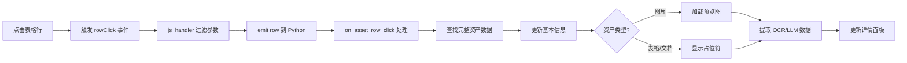
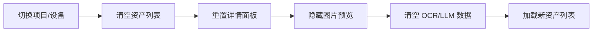

# PC 端 UI 布局优化方案

## 文档信息

- **版本**: 1.0
- **创建日期**: 2025-01-21
- **作者**: BDC-AI 开发团队
- **状态**: 待实现

---

## 1. 背景与问题

### 当前问题

1. **图片预览位置不当**
   - 图片放置在界面最下方
   - 用户必须滚动才能看到预览图片
   - 影响用户体验

2. **表格列过多**
   - 显示 5 列：ID、标题、类型、角色、采集时间
   - ID 列对用户无意义
   - 完整时间戳占用空间
   - 表格占用宽度过大

3. **信息展示不足**
   - 右侧详情面板只显示基本信息
   - 缺少 OCR/LLM 识别结果展示
   - 图片预览区域信息密度低

4. **空间利用不合理**
   - 资产列表占用约 70% 宽度
   - 详情和图片预览只占 30%
   - 信息层次不清晰

---

## 2. 优化目标

### 主要目标

1. **一屏可见**
   - 关键信息在首屏完整展示
   - 减少滚动操作
   - 提升浏览效率

2. **信息层次清晰**
   - 左侧：工程结构导航
   - 右侧：资产浏览（列表 + 详情 + 预览）
   - 详情区：基本信息 → 图片 → 识别结果

3. **表格精简**
   - 只显示 4 个关键列
   - 删除 ID 等冗余字段
   - 优化列宽和展示方式

4. **信息丰富**
   - 增加 OCR/LLM 识别结果展示
   - 关键词提取和展示
   - 智能信息摘要

---

## 3. UI 布局设计

### 整体布局

```
┌─────────────────────────────────────────────────────────────────────────┐
│  BDC-AI 工程结构与资产浏览系统                                           │
└─────────────────────────────────────────────────────────────────────────┘

┌──────────────┬────────────────────────────────────────────────────────────┐
│              │                                                             │
│  左侧面板    │                     右侧内容区                              │
│  (320px)     │                    (flex-grow: 1)                         │
│              │                                                             │
│  ┌────────┐  │  ┌──────────────────────────────────────────────────┐   │
│  │ 工程结构│  │  │ 项目信息                                        │   │
│  │        │  │  │  演示项目 - 华润广场 [TEST]                     │   │
│  │  项目  │  │  │  客户: 华润 • 位置: 北京 • 状态: 运行中         │   │
│  │    ├─建筑│  │  │                                   [刷新按钮]     │   │
│  │    ├─区域│  │  └──────────────────────────────────────────────────┘   │
│  │    └─设备│  │                                                          │
│  │        │  │  ┌────────────┬─────────────────────────────────────┐   │
│  │ 🔍搜索 │  │  │ 资产列表   │        资产详情 + 图片预览         │   │
│  └────────┘  │  │  (40%)     │              (60%)                 │   │
│              │  │            │                                     │   │
│              │  │ 过滤器:    │  ┌─────────────────────────────────┐ │   │
│              │  │ [类型▼]    │  │ 📋 基本信息                     │ │   │
│              │  │ [角色▼]    │  │ 标题: IMG_20250710_144534.jpg    │ │   │
│              │  │ [时间▼]    │  │ 类型: image • 角色: meter        │ │   │
│              │  │            │  │ 采集: 2025-07-10 14:45           │ │   │
│              │  │ 共 16 条   │  │ 描述: 现场仪表读数照片...        │ │   │
│              │  │            │  └─────────────────────────────────┘ │   │
│              │  │ ┌──────────┤                                     │   │
│              │  │ │标题  类型│  ┌─────────────────────────────────┐ │   │
│              │  │ ├──────────┤  │ 🖼️ 图片预览 (400x300)           │ │   │
│              │  │ │IMG... img│  │ ┌───────────────────────────┐   │ │   │
│              │  │ │IMG... tbl│  │ │                           │   │ │   │
│              │  │ │IMG... img│  │ │   [预览图片]              │   │ │   │
│              │  │ │...        │  │ │                           │   │ │   │
│              │  │ └──────────┤  │ └───────────────────────────┘   │ │   │
│              │  │            │  └─────────────────────────────────┘ │   │
│              │  │            │                                     │   │
│              │  │            │  ┌─────────────────────────────────┐ │   │
│              │  │            │  │ 🤖 OCR/LLM 识别结果             │ │   │
│              │  │            │  │ ┌───────────────────────────┐   │ │   │
│              │  │            │  │ │ 检测到 3 个对象:          │   │ │   │
│              │  │            │  │ │ • 仪表盘 (0.95)           │   │ │   │
│              │  │            │  │ │ • 读数 "12.5" (0.92)      │   │ │   │
│              │  │            │  │ │ • 品牌 "XX" (0.87)        │   │ │   │
│              │  │            │  │ │                           │   │ │   │
│              │  │            │  │ │ OCR 文本:                 │   │ │   │
│              │  │            │  │ │ "空调主机温度: 12.5°C"     │   │ │   │
│              │  │            │  │ └───────────────────────────┘   │ │   │
│              │  │            │  │                                     │   │
│              │  │            │  │ [🔍 打开原始文件]                   │   │
│              │  │            │  └─────────────────────────────────┘ │   │
│              │  └────────────┴─────────────────────────────────────┘   │
│              │                                                          │
└──────────────┴──────────────────────────────────────────────────────────┘
```

---

## 4. 详细设计说明

### 4.1 左侧面板（固定宽度 320px）

#### 工程结构树组件

**布局**:
```python
with ui.card().style("width: 320px; height: 100%; overflow: auto;"):
    ui.label("工程结构").classes("text-h6")
    project_select = ui.select({}, value=None, label="项目")
    tree_search = ui.input(placeholder="搜索结构名称...").props("dense clearable")
    tree_widget = ui.tree([]).props("node-key=id")
```

**功能**:
- 项目下拉选择
- 实时搜索过滤
- 树形结构展示
- 点击设备节点加载资产

---

### 4.2 右侧内容区（flex-grow: 1）

#### 4.2.1 顶部项目信息区

**布局**:
```python
with ui.column().classes("q-pa-md"):
    with ui.row().classes("items-center justify-between w-full"):
        project_title = ui.label().classes("text-h6")
        refresh_button = ui.button(icon="refresh").props("flat round dense")
    project_meta = ui.label().classes("text-caption text-grey")
```

**内容**:
- 项目标题 + TEST 标签
- 元数据行（客户、位置、状态）
- 刷新按钮

---

#### 4.2.2 过滤器行

**布局**:
```python
with ui.row().classes("items-center q-gutter-sm"):
    modality_filter = ui.select({
        "": "全部类型",
        "image": "图片",
        "table": "表格",
        "document": "文档",
    }, value="", label="类型").props("dense outlined")

    role_filter = ui.select({
        "": "全部角色",
        "meter": "仪表",
        "scene_issue": "现场问题",
        "nameplate": "铭牌",
    }, value="", label="角色").props("dense outlined")

    time_filter = ui.select({
        "all": "所有时间",
        "7d": "最近7天",
        "30d": "最近30天",
    }, value="all", label="时间").props("dense outlined")

result_count_label = ui.label().classes("text-caption text-grey")
```

---

#### 4.2.3 资产列表（40% 宽度）

**表格定义**:
```python
asset_table = ui.table(
    columns=[
        {
            "name": "title",
            "label": "标题",
            "field": "title",
            "sortable": True,
            "style": "max-width: 150px; overflow: hidden; text-overflow: ellipsis;",
        },
        {
            "name": "modality",
            "label": "类型",
            "field": "modality",
            "sortable": True,
            "style": "width: 80px;",
        },
        {
            "name": "short_date",
            "label": "日期",
            "field": "short_date",
            "sortable": True,
            "style": "width: 80px;",
        },
        {
            "name": "keywords",
            "label": "关键词",
            "field": "keywords",
            "style": "width: 120px;",
        },
    ],
    rows=[],
    row_key="id",
    selection="single",
).classes("w-full")
```

**列说明**:

| 列名 | 字段 | 宽度 | 说明 | 示例 |
|------|------|------|------|------|
| 标题 | title | 150px | 截断显示，hover 显示完整 | IMG_20250710_... |
| 类型 | modality | 80px | icon + 文本 | 📷 图片 |
| 日期 | short_date | 80px | MM-DD 格式 | 07-10 |
| 关键词 | keywords | 120px | 从 tags/OCR 提取 | 仪表, 读数 |

**数据转换**:
```python
# 在返回给表格前，添加辅助字段
for asset in assets:
    # 短日期
    capture_time = asset.get("capture_time")
    if capture_time:
        asset["short_date"] = capture_time.strftime("%m-%d")
    else:
        asset["short_date"] = "-"

    # 关键词提取
    asset["keywords"] = extract_keywords(asset)
```

---

#### 4.2.4 资产详情 + 图片预览（60% 宽度）

**整体布局**（从上到下）:

##### 1. 基本信息卡片

```python
with ui.card().classes("w-full"):
    ui.label("📋 基本信息").classes("text-subtitle2 q-mb-sm")

    detail_title = ui.label().classes("text-h6")
    detail_meta = ui.label().classes("text-caption text-grey q-mb-xs")
    detail_description = ui.label().classes("text-body2")
```

**显示内容**:
- 标题（完整）
- 元信息：类型、角色、采集时间
- 描述（完整显示，最多 3 行）

##### 2. 图片预览区域（固定高度 350px）

```python
with ui.card().classes("w-full"):
    ui.label("🖼️ 图片预览").classes("text-subtitle2 q-mb-sm")

    with ui.row().classes("items-center justify-center"):
        if selected_asset and selected_asset.get("modality") == "image":
            preview_image = ui.image().style("max-width: 100%; max-height: 300px;")
            preview_button = ui.button("预览图片", icon="visibility")
        else:
            ui.label("暂无图片预览").classes("text-grey text-caption")
```

**图片来源**:
- 从 `selected_asset.file_path` 读取
- Base64 编码内嵌显示
- 本地路径安全校验

##### 3. OCR/LLM 识别结果卡片

```python
with ui.card().classes("w-full"):
    ui.label("🤖 OCR/LLM 识别结果").classes("text-subtitle2 q-mb-sm")

    # 对象检测列表
    with ui.column().classes("q-gutter-xs"):
        for obj in detected_objects[:3]:  # Top 3
            with ui.row().classes("items-center q-gutter-sm"):
                ui.label(f"• {obj['label']}").classes("text-body2")
                ui.badge(f"{obj['confidence']:.0%}", color="blue")

    # OCR 文本
    if ocr_text:
        ui.label("OCR 文本:").classes("text-caption text-grey q-mt-sm")
        ocr_label = ui.label(ocr_text[:100] + "..." if len(ocr_text) > 100 else ocr_text)
        ocr_label.classes("text-body2 font-mono bg-grey-1 q-pa-sm rounded")

    # LLM 总结
    if llm_summary:
        ui.label("AI 分析:").classes("text-caption text-grey q-mt-sm")
        summary_label = ui.label(llm_summary[:200] + "..." if len(llm_summary) > 200 else llm_summary)
        summary_label.classes("text-body2 bg-blue-1 q-pa-sm rounded")

    # 操作按钮
    with ui.row().classes("q-mt-sm q-gutter-sm"):
        open_file_button = ui.button("打开原始文件", icon="folder_open")
        if selected_asset and selected_asset.get("modality") == "image":
            preview_button = ui.button("预览大图", icon="fullscreen")
```

---

## 5. 数据结构说明

### 5.1 Asset 数据模型

```python
{
    "id": "uuid",
    "project_id": "uuid",
    "title": "资产标题",
    "modality": "image|table|document|text|audio",
    "content_role": "meter|scene_issue|nameplate|...",
    "capture_time": "2025-01-10T14:45:00Z",
    "description": "描述文本",
    "tags": {"environment": "test", "category": "HVAC"},
    "file_path": "relative/path/to/file.jpg",  # 从 FileBlob 获取

    # 结构化数据（从 AssetStructuredPayload）
    "structured_payload": {
        "schema": "image_annotation|table_data|text_note|...",
        "payload": {...}
    }
}
```

### 5.2 图片类型的 structured_payload

```python
{
    "schema": "image_annotation",
    "payload": {
        "objects": [
            {
                "label": "仪表盘",
                "confidence": 0.95,
                "bbox": [x, y, w, h]
            },
            {
                "label": "读数",
                "confidence": 0.92,
                "text": "12.5",
                "bbox": [x, y, w, h]
            }
        ],
        "ocr_text": "空调主机温度: 12.5°C\n读数正常",
        "llm_summary": "现场仪表显示温度为12.5度，在正常范围内。建议持续监测。",
        "global_tags": ["HVAC", "温度", "正常"]
    }
}
```

### 5.3 表格类型的 structured_payload

```python
{
    "schema": "table_data",
    "payload": {
        "headers": ["日期", "时间", "读数", "单位"],
        "rows": [
            ["2025-01-01", "08:00", "12.5", "°C"],
            ["2025-01-01", "09:00", "12.8", "°C"]
        ],
        "primary_index": ["日期", "时间"],
        "llm_analysis": "能耗数据稳定，日平均温度12.6°C，无明显异常波动。",
        "data_quality": "good"  # good/medium/bad
    }
}
```

### 5.4 关键词提取逻辑

```python
def extract_keywords(asset: Dict[str, Any]) -> str:
    """从资产中提取关键词，用于表格展示"""

    keywords = []

    # 1. 从 tags 提取
    tags = asset.get("tags", {})
    if isinstance(tags, dict):
        for key, value in tags.items():
            if key not in ["environment", "source"]:
                keywords.append(str(value))

    # 2. 从 content_role 提取
    role = asset.get("content_role")
    if role:
        keywords.append(role)

    # 3. 从 structured_payload 提取
    payload = asset.get("structured_payload", {})
    if payload.get("schema") == "image_annotation":
        data = payload.get("payload", {})
        # 从 global_tags 提取
        global_tags = data.get("global_tags", [])
        keywords.extend(global_tags[:2])
        # 从 objects 提取 top 2 标签
        objects = data.get("objects", [])
        for obj in objects[:2]:
            label = obj.get("label")
            if label:
                keywords.append(label)

    # 4. 从 title 提取（去除文件扩展名）
    title = asset.get("title", "")
    if "." in title:
        base_name = title.rsplit(".", 1)[0]
        # 分割并取前 2 个有意义的词
        parts = base_name.replace("-", " ").replace("_ " " ").split()
        keywords.extend(parts[:2])

    # 去重并限制数量
    keywords = list(dict.fromkeys(keywords))  # 保持顺序的去重
    return ", ".join(keywords[:3])  # 最多返回 3 个
```

---

## 6. 实现要点

### 6.1 响应式布局

**关键代码**:
```python
with ui.row().style("height: 100vh; width: 100vw;"):
    # 左侧固定宽度
    with ui.card().style("width: 320px; height: 100%; overflow: auto;"):
        # 工程结构树
        pass

    # 右侧自适应
    with ui.column().style("flex-grow: 1; height: 100%; overflow: auto;"):
        # 资产列表 + 详情
        with ui.row().classes("w-full"):
            # 左侧：资产列表（40%）
            with ui.column().style("width: 40%;"):
                # 表格
                pass

            # 右侧：详情 + 预览（60%）
            with ui.column().style("width: 60%;"):
                # 基本信息
                # 图片预览
                # OCR/LLM 结果
                pass
```

### 6.2 表格行高优化

```python
asset_table = ui.table(
    columns=[...],
    rows=[],
    row_key="id",
    selection="single",
).props('dense flat')  # 使用紧凑模式
```

### 6.3 图片懒加载

```python
# 只在选中图片类型资产时才加载
if selected_asset and selected_asset.get("modality") == "image":
    file_path = selected_asset.get("file_path")
    if file_path and os.path.exists(abs_path):
        # 加载并显示图片
        preview_image.source = load_image_as_base64(abs_path)
        preview_image.visible = True
    else:
        preview_image.visible = False
        ui.label("图片文件不存在").classes("text-caption text-grey")
else:
    preview_image.visible = False
    ui.label("非图片资产，无预览").classes("text-caption text-grey")
```

### 6.4 OCR/LLM 数据获取

```python
def get_ocr_llm_data(asset: Dict[str, Any]) -> Dict:
    """从资产中提取 OCR/LLM 数据"""

    payload = asset.get("structured_payload", {})
    schema = payload.get("schema")
    data = payload.get("payload", {})

    result = {
        "objects": [],
        "ocr_text": None,
        "llm_summary": None,
        "data_quality": None
    }

    if schema == "image_annotation":
        result["objects"] = data.get("objects", [])
        result["ocr_text"] = data.get("ocr_text")
        result["llm_summary"] = data.get("llm_summary")
        result["global_tags"] = data.get("global_tags", [])

    elif schema == "table_data":
        result["llm_summary"] = data.get("llm_analysis")
        result["data_quality"] = data.get("data_quality")
        result["row_count"] = len(data.get("rows", []))

    return result
```

---

## 7. 交互流程

### 7.1 选择资产行



### 7.2 切换项目/设备



---

## 8. 性能优化

### 8.1 图片加载优化

1. **按需加载**: 只在选中图片资产时加载
2. **尺寸限制**: 预览图最大 400x300px
3. **Base64 缓存**: 加载后缓存到内存
4. **懒加载**: 首屏只加载可见图片

### 8.2 数据渲染优化

1. **虚拟滚动**: 表格行数 > 50 时启用虚拟滚动
2. **分页加载**: 单次最多加载 100 条资产
3. **防抖搜索**: 树搜索输入 300ms 后执行
4. **关键词缓存**: 预计算并缓存关键词

### 8.3 OCR/LLM 数据优化

1. **Top N 限制**: 只显示 top 3 对象
2. **文本截断**: OCR/LLM 文本超过 100/200 字符时截断
3. **按需展开**: 提供"展开全部"按钮
4. **缓存结果**: 缓存已加载的 OCR/LLM 数据

---

## 9. 样式规范

### 9.1 颜色方案

```python
# 基础颜色
PRIMARY_COLOR = "#1976D2"      # 主色调（蓝色）
SUCCESS_COLOR = "#43A047"      # 成功（绿色）
WARNING_COLOR = "#FFA000"      # 警告（橙色）
NEGATIVE_COLOR = "#D32F2F"     # 错误（红色）
GREY_COLOR = "#757575"         # 灰色（次要文本）

# 背景色
BG_LIGHT = "#F5F5F5"           # 浅灰背景
BG_WHITE = "#FFFFFF"           # 白色背景
BG_CARD = "#FAFAFA"            # 卡片背景
```

### 9.2 字体大小

```python
FONT_H6 = "16px"               # 标题
FONT_SUBTITLE1 = "15px"        # 小标题
FONT_SUBTITLE2 = "14px"        # 次级标题
FONT_BODY1 = "16px"            # 正文
FONT_BODY2 = "14px"            # 次要正文
FONT_CAPTION = "12px"          # 说明文字
```

### 9.3 间距规范

```python
SPACING_NONE = 0
SPACING_XS = "4px"
SPACING_SM = "8px"
SPACING_MD = "16px"
SPACING_LG = "24px"
SPACING_XL = "32px"
```

---

## 10. 实现检查清单

### 阶段 1: 基础布局调整

- [ ] 修改主布局为左固定 + 右自适应
- [ ] 调整资产列表为 40% 宽度
- [ ] 调整详情区域为 60% 宽度
- [ ] 实现两列布局（列表 + 详情）

### 阶段 2: 表格优化

- [ ] 删除 ID 列
- [ ] 添加短日期列（short_date）
- [ ] 添加关键词列（keywords）
- [ ] 调整列宽和样式
- [ ] 实现关键词提取函数

### 阶段 3: 详情面板重构

- [ ] 创建基本信息卡片
- [ ] 移动图片预览到基本信息下方
- [ ] 创建 OCR/LLM 识别结果卡片
- [ ] 调整卡片顺序和信息层级

### 阶段 4: 图片预览优化

- [ ] 设置固定高度（350px）
- [ ] 实现居中显示
- [ ] 添加占位符逻辑
- [ ] 优化图片加载性能

### 阶段 5: OCR/LLM 数据展示

- [ ] 实现数据提取函数
- [ ] 创建对象检测列表
- [ ] 添加 OCR 文本展示
- [ ] 添加 LLM 总结展示
- [ ] 处理不同模态类型

### 阶段 6: 交互优化

- [ ] 实现行点击联动
- [ ] 添加加载状态提示
- [ ] 优化过滤性能
- [ ] 添加错误处理

### 阶段 7: 样式优化

- [ ] 统一卡片样式
- [ ] 优化间距和对齐
- [ ] 添加图标和颜色
- [ ] 响应式调整

### 阶段 8: 测试与调试

- [ ] 功能测试
- [ ] 性能测试
- [ ] 兼容性测试
- [ ] 用户验收测试

---

## 11. 后续优化方向

### 11.1 短期优化（1-2周）

1. **添加图片缩略图**
   - 表格中显示小缩略图
   - 快速预览功能

2. **批量操作**
   - 多选资产
   - 批量导出
   - 批量标签

3. **高级过滤**
   - 自定义日期范围
   - 多选角色
   - 组合条件

### 11.2 中期优化（1个月）

1. **虚拟化滚动**
   - 大数据量表格优化
   - 懒加载优化

2. **详情面板标签页**
   - 基本信息
   - 图片预览
   - OCR/LLM 结果
   - 历史版本
   - 相关资产

3. **数据可视化**
   - 资产类型分布图
   - 时间分布图
   - 质量评分

### 11.3 长期优化（3个月+）

1. **AI 辅助浏览**
   - 智能推荐
   - 相似资产查找
   - 异常检测

2. **协作功能**
   - 评论和标注
   - 审核流程
   - 权限控制

3. **移动端适配**
   - 响应式布局
   - 触摸优化
   - 离线支持

---

## 12. 风险与挑战

### 12.1 技术风险

1. **性能问题**
   - 大量图片预览可能影响性能
   - OCR/LLM 数据量大
   - 缓存策略复杂

   **缓解措施**:
   - 懒加载和虚拟化
   - 分页和按需加载
   - 客户端缓存

2. **数据不完整**
   - 旧资产可能缺少 OCR/LLM 数据
   - 部分字段可能为空

   **缓解措施**:
   - 提供默认占位符
   - 渐进式展示
   - 明确提示数据缺失

### 12.2 用户体验风险

1. **布局适应**
   - 不同屏幕尺寸适配
   - 用户习惯改变

   **缓解措施**:
   - 提供布局切换选项
   - 渐进式发布
   - 用户培训

2. **信息过载**
   - 信息量增加可能造成困惑
   - 关键信息不突出

   **缓解措施**:
   - 清晰的信息层级
   - 可折叠面板
   - 智能默认值

---

## 13. 成功指标

### 13.1 性能指标

- 首屏加载时间 < 2秒
- 表格渲染时间 < 500ms
- 图片加载时间 < 1秒
- 响应时间（点击 → 详情更新）< 200ms

### 13.2 用户体验指标

- 一屏可见率达到 90%
- 滚动次数减少 50%
- 信息查找效率提升 30%
- 用户满意度 > 4.5/5

### 13.3 功能指标

- 支持所有模态类型（image/table/document）
- OCR/LLM 数据展示覆盖率 > 80%
- 关键词提取准确率 > 85%
- 图片预览成功率 > 95%

---

## 14. 参考资料

- [NiceGUI 官方文档](https://nicegui.io/documentation)
- [Quasar Table 组件](https://quasar.dev/vue-components/table)
- [BDC-AI 项目总结](./项目总结.md)
- [NiceGUI 表格行点击解决方案](./nicegui-table-row-click-solution.md)

---

## 15. 变更历史

| 版本 | 日期 | 作者 | 变更说明 |
|------|------|------|----------|
| 1.0 | 2025-01-21 | BDC-AI 团队 | 初始版本 |

---

**文档结束**
